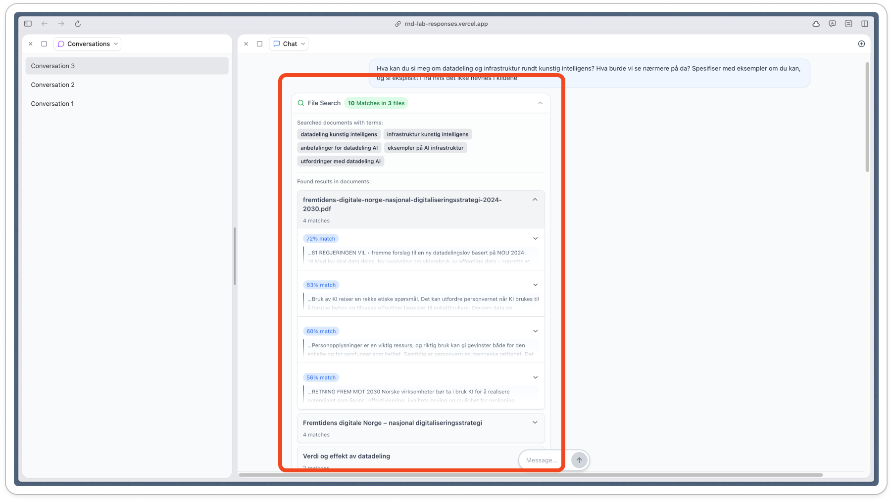

| **Relatert til** |                                      |
| ---------------- | ------------------------------------ |
| **Status**       | not started / in progress / complete |
## Linker til arbeid

## Formål

Vi snakker om begrepet "blackbox" fordi det er vanskelig eller umulig for brukeren å vite hva språkmodellen faktisk gjør. Hvordan framgangsmetoden ser ut for å komme fram til resultatet man får. Derfor er det viktig at vi tydeliggjør det så langt vi har mulighet til.

## Kjappe tanker

- Olav har jobba med dette allerede (i retrieval-fanen i admin-grensesnittet)
- Se eksempel i [Simons prototype](Simons%20prototype.md)

## Utforskende skisse

En måte å gjøre dette på er å bruke en et element fra [Simons prototype](Simons%20prototype.md), hvor vi kan skjule informasjonen (gjennom [en sammenleggbar komponent](https://designsystemet.no/no/components/docs/details/overview)).

Dette vil sannsynligvis også forenkle leseropplevelsen siden det løfter sekundær informasjon (nøkkelordene) ut av svaret.

### Hvordan det ser ut i dagens produksjonsmiljø
Dato: 15.12.2025

## Antagelser

## Åpne spørsmål

| **Spørsmål** | **Svar** | **Dato besvart** |
| ------------ | -------- | ---------------- |
|              |          |                  |

## Omfang

| **Must have:**    |     |
| ----------------- | --- |
| **Nice to have:** |     |
| **Not in scope:** |     |

## Interaksjon og design

## Referanser